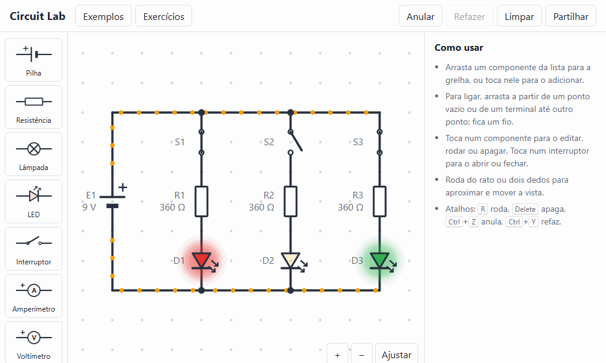

# Circuit Lab

An electric circuit simulator that runs in the browser: place batteries, resistors, LEDs, lamps, switches and meters on a grid, wire them up, and see the voltage and current of every part update as you build.

**[Open Circuit Lab](https://gabrielsvarela1.github.io/circuit-lab/)** (interface in European Portuguese; works with a mouse or a touch screen)



It also has example circuits and eight guided exercises (Ohm's law, voltage divider, Kirchhoff's laws, Wheatstone bridge and others) that are checked by the simulator. Circuits are saved in the browser and can be shared as a link.

## Run locally

Requires Node 22 or later.

```sh
npm install
npm run dev     # http://localhost:5173
npm test        # engine and model tests (Vitest)
npm run e2e     # browser tests on desktop and phone sizes (Playwright, uses the installed Chrome)
npm run build
```

## How the solver works

The engine is in `src/engine/`, written from scratch with no circuit or maths libraries and no DOM code.

1. Every grid point is a node. Wires and closed switches merge their two nodes with a union-find, so ideal conductors never enter the equations.
2. Batteries and ammeters are ideal voltage sources. They are added to a second union-find that also tracks node potentials, so a source that closes a loop of sources with a net EMF is reported as a short circuit before any solving.
3. The other parts are stamped into a modified nodal analysis (MNA) system: a conductance for each resistor and lamp, plus one extra row and column per source. Each unconnected part of the circuit gets its own reference node.
4. The system is solved by Gaussian elimination with partial pivoting.
5. LEDs follow the Shockley diode equation. Newton's method linearises each one around its last voltage (a conductance plus a current source) and limits the step, as SPICE does, so the exponential cannot overflow. An LED above 30 mA burns and becomes an open circuit.
6. Wire currents come from Kirchhoff's current law inside each merged node; that is what drives the moving dots.
7. A battery with no closed path back to itself is reported as an open circuit.

The tests in `src/engine/__tests__` compare the solver with textbook circuits solved by hand: series, parallel, voltage divider, Wheatstone bridge, two meshes with Kirchhoff's laws, short circuits and open circuits.
